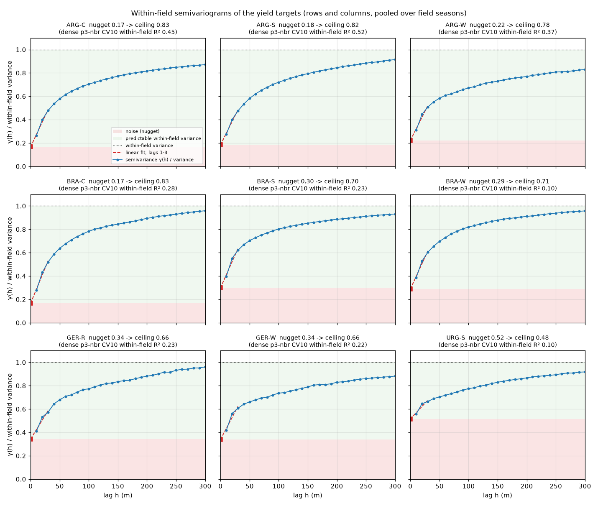
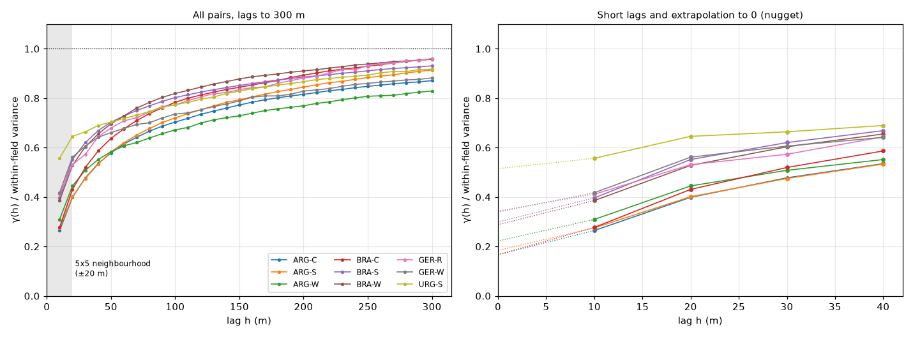
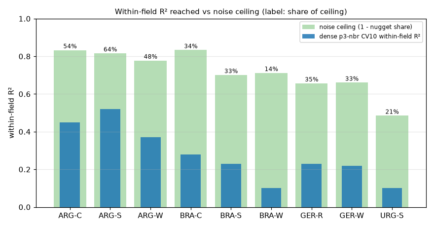

# Field context for within-field yield patterns

**Status (2026-10-09): adopted (project lead). FC-01 done (§3); FC-02..FC-04
in progress.**

Related:
- [yieldsat-relational-loss.md](./yieldsat-relational-loss.md): within-field
  metrics, relation loss RL-04, image models §8.
- [yieldsat-dense-series.md](./yieldsat-dense-series.md): dense p3-nbr, the
  base model.

## 1. Motivation

Each pixel is predicted on its own, from inputs about that pixel only:

| Input | Spatial extent |
|---|---|
| S2 time series (12 bands, 72 slots) | the cell (10 m) |
| S2 neighbourhood stream (`--neighbourhood`) | mean of the 5×5 cells around it, centre excluded (≈ 50 m) |
| DEM, terrain (aspect, curvature, slope, TWI), soil | the cell; terrain derivatives carry a little local context |
| Weather | the field (same for every cell) |

**Why this caps the pattern:**
- Two cells get different predictions only if their inputs differ.
- The within-field pattern is relative: this spot vs the rest of the field.
- The model never sees the rest of the field, so it must infer relative
  position from absolute values that vary much more between fields than
  within them.

**What the relation loss showed** (RL-04): it supervises differences but
cannot add information. Gain +0.01 within-field R².

**What the image models showed** (relational-loss §8): context alone is not
enough. They saw whole tiles but had lower within-field correlation. How the
context is presented matters.

**Proposal:** give the point model explicit field-relative inputs. The
relation loss can then act on features that express differences directly.

## 2. Within-field R² is bounded by r

Centre each field on its own mean; r = within-field Pearson correlation of
prediction and target; k = std ratio. Then

  within-field R² = 2·r·k − k²

This is maximal at k = r, where it equals r².
- Contrast (k) cannot be added without a better pattern (r).
- Image v2 is the counter-example: k 0.59 > r 0.38 lowered its within-field
  R² below v1.
- **Target of this spec: raise r.**

## 3. Noise ceiling (FC-01, done)

Not all within-field variance is predictable. Harvester noise and sub-cell
variation are uncorrelated even between adjacent cells.

**Method** (`yieldsat_noise_ceiling.py`, `results/noise_ceiling.json`):
- Targets only, no model.
- Per field season, targets centred and placed on the 10 m grid.
- Semivariogram γ(h) along rows and columns, h = 1..4 cells, pooled per pair.
- Linear extrapolation of γ(1..3) to h = 0 gives the nugget.
- Ceiling = 1 − nugget / within-field variance: the within-field R² of a
  perfect noise-free predictor.

| Pair | Fields | γ(1)/var | Nugget share | **Ceiling within-field R²** | Dense p3-nbr CV10 | Share of ceiling reached |
|---|---|---|---|---|---|---|
| ARG-C | 185 | 0.26 | 0.17 | **0.83** | 0.45 | 54% |
| ARG-S | 440 | 0.28 | 0.18 | **0.82** | 0.52 | 64% |
| ARG-W | 126 | 0.31 | 0.22 | **0.78** | 0.37 | 47% |
| BRA-C | 118 | 0.28 | 0.17 | **0.83** | 0.28 | 34% |
| BRA-S | 293 | 0.40 | 0.30 | **0.70** | 0.23 | 33% |
| BRA-W | 140 | 0.39 | 0.29 | **0.71** | 0.10 | 14% |
| GER-R | 111 | 0.41 | 0.34 | **0.66** | 0.23 | 35% |
| GER-W | 188 | 0.42 | 0.34 | **0.66** | 0.22 | 33% |
| URG-S | 572 | 0.56 | 0.52 | **0.48** | 0.10 | 21% |
| **Mean** | | | 0.28 | **0.72** | 0.28 | ≈ 38% |

**Reading:**
1. On average about 28% of within-field variance is noise. The best possible
   within-field R² is ≈ 0.72; dense p3-nbr reaches 0.28.
   - There is large headroom on every pair.
   - URG-S is the noisiest (ceiling 0.48), which explains part of its low
     scores.
2. The variogram is still rising at h = 4 (γ ≈ 0.53–0.69 of the variance).
   Much of the predictable structure lives at scales beyond 40 m, larger than
   the current 5×5 neighbourhood.
3. **Caveat: an estimate, not a bound.** The errors go both ways.
   - The yield maps were harmonized to the 10 m grid, which smooths adjacent
     cells. Less apparent noise, so the ceiling comes out too high.
   - Real variograms are usually concave near 0. A straight line through
     h = 1..3 is flatter than the true curve at 0, so its intercept is too
     high. More apparent noise, so the ceiling comes out too low.
   - The headroom conclusion holds even if the ceiling were 0.15 lower.

**Figures** (`results/figures/semivariogram/`, script `plot_semivariogram.py`;
lags extended to 30 cells for the plots; the nugget fit stays on lags 1–3):

*Per pair: γ(h) / within-field variance (blue), the linear fit on lags 1–3
extrapolated to 0 (red dashed), the nugget (red square, red band = noise),
the predictable part (green).*

*Left: all pairs to 300 m; grey = reach of the 5×5 neighbourhood stream
(±20 m). Right: short lags and the extrapolation to the nugget.*

*Noise ceiling vs dense p3-nbr CV10 within-field R²; labels = share of the
ceiling reached.*

**What the figures show:**
1. The curves are concave near 0 (fastest rise in the first 10–20 m). The
   straight-line extrapolation is therefore somewhat high: see the caveat
   above.
2. URG-S jumps to 0.56 at 10 m: most of its within-field variance is
   cell-to-cell noise.
3. **No pair reaches its sill within 300 m** (γ at 300 m ≈ 0.83–0.96 of the
   variance).
   - Yield stays correlated over hundreds of metres; much of the predictable
     pattern sits at 50–300 m, near field scale.
   - The 5×5 neighbourhood (±20 m) sees only the start of that range.
   - This supports field-level context (§4) over a slightly wider window.

**Why the intercept is the noise.** Write y′ = s + e:
- s: spatially correlated signal.
- e: cell-independent noise with variance σₑ².

For h > 0, γ(h) = σₑ² + γₛ(h) with γₛ(0) = 0. So γ extrapolated to 0 is
σₑ², and no input can explain e: max within-field R² = 1 − σₑ² / var(y′).

**Worked example, ARG-W** (γ / variance):
- γ(1..3) = 0.310, 0.445, 0.508.
- Least-squares line: slope 0.099, intercept 0.222 = nugget share.
- Ceiling 0.78.

## 4. Field-context inputs (FC-02, FC-03)

All are computed from inputs of the same field season only: no labels, no
split, like the cache and the neighbourhood stream.
- The field extent is the set of the field season's grid cells; the boundary
  is known at prediction time.
- At test time a field's features use that field's own imagery. This is
  available whenever the field is predicted.
- The test set gets the same streams, computed the same way from the test
  field's own inputs. The only training-fold statistic is the usual S2
  normalization.
- **Caveat (footprint):** a field's extent is its set of cells in the
  yield-map index, not an independent boundary polygon.
  - Edge distance (and which cells enter the field means) therefore follows
    the yield map's footprint: where yield data exist, not their values.
  - In deployment the field boundary plays this role.

| Stream | Kind | Channels | Definition |
|---|---|---|---|
| `yieldsat_s2_field` | temporal | 24 | Per slot, field mean of each S2 band (normalized like S2) and field std (divided by the S2 std). What the field as a whole looks like. |
| `yieldsat_s2_dev` | temporal | 12 | Per slot, the cell's S2 value minus the field mean, divided by the field std (within-field z-score, clipped to ±5). Is this cell greener or browner than its field, and by how much? |
| `yieldsat_field_rel` | static | 5 | Within-field z-scores of elevation, slope, curvature and TWI; log(1 + chessboard distance to the field edge in cells, capped at 50) / log(51). Where the cell sits in the field: high or low, steep, wet, edge or interior. |

**Validity rules:**
- A slot is valid where the field has ≥ 3 valid cells and a nonzero std.
- `yieldsat_s2_dev` is valid where the cell itself is valid.
- `yieldsat_field_rel` is valid where the cell's channel is valid and the
  field std > 0.
- TWI is mostly missing in the source data itself (valid in Germany 0.1%,
  Uruguay 27%, Argentina 24%, Brazil 59% of cells), so `rel_twi` is often
  masked.

**Builder:** `yieldsat_build_field_context.py` writes
`<NBR_NAME>/<Country>/field_s2.npz` (per field: mean, std, field codes) and
`field_rel.npy` (rows × 5).
- Placed next to the neighbourhood file, so the existing unit staging
  (`neighbourhood_dense/<Country>`) carries it.
- The trainer flag is `--field_context`.

## 5. Plan

| ID | Deliverable | Acceptance |
|---|---|---|
| FC-01 | Noise ceiling per pair | Done (§3) |
| FC-02 | Builder for the field-context arrays (dense cache) | Unit test: z-scores have field mean 0 / std 1; edge distance 0 at the border; outputs aligned with cache rows |
| FC-03 | Dataset streams + `--field_context` | Unit test: deviation stream equals (cell − field mean)/field std; no target used |
| FC-04 | DEV test, as RL-04: 4 DEV pairs × CV10 + LOYO. Arms: dense p3-nbr + field context (`-fc`) and + field context + relation loss λ = 1 (`-fc-rel10`) | Within-field R² clearly up vs dense p3-nbr (field-season bootstrap), pooled R² not lower. Also compared with RL-04 `-rel10` |
| FC-05 | If FC-04 passes: all 9 pairs × CV10/LOYO/LORO | As FC-04 |
